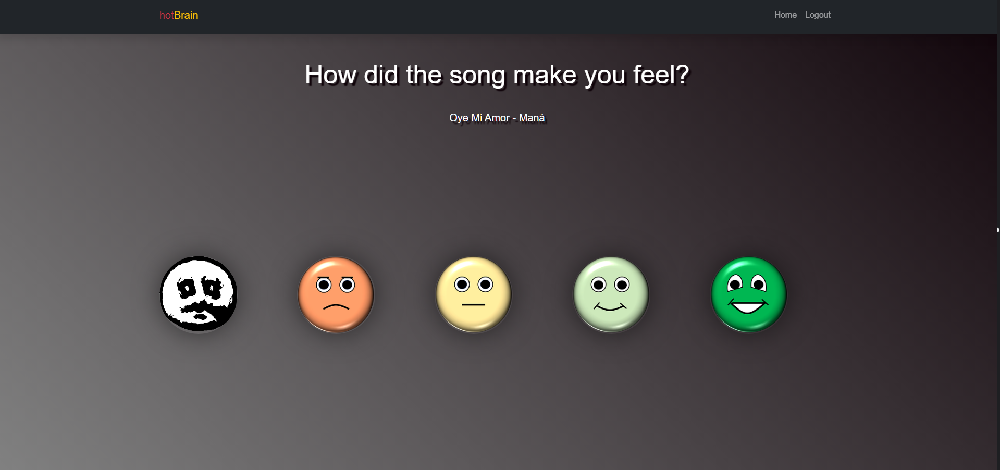
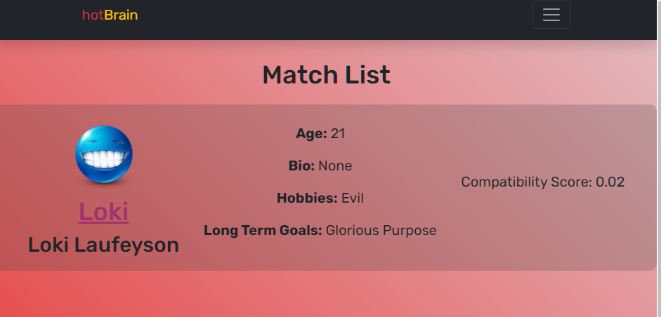

# hotBrain
##  Neural dating web application  BrainBit SDK
[Professor Jardin's Starter Code](https://github.com/cjardin/cs370_fall_2023_REST)
Neural dating full-stack web application using `HTML/CSS/JS`, `Python Flask`, and the `BrainBit SDK`  
Built by Andres Hinojosa, Ased Adus, Kyrstn Hall, Salma Rashed and Tyler Felicidario  

--------------------

--------------------
--------------------

--------------------
--------------------

--------------------

### Feautures
- Sign up/Login
- Survey
- Connect Headband, Video access
--------------------

### To run, must be in windows power shell..

1. Install python on your machine from python.org
2. Clone this repo
3. cd into the repo dir
4. pip intall -r requirements.txt
5. python app.py
