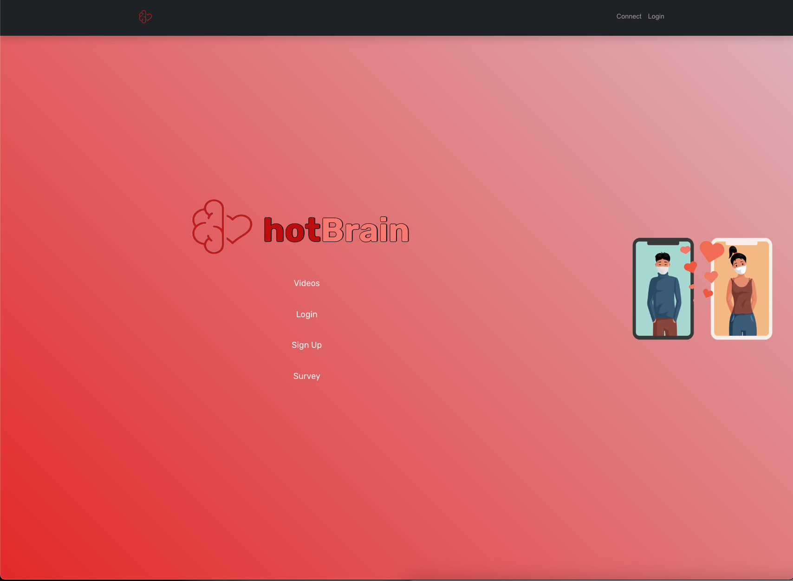

# hotBrain
##  Neural dating web application  BrainBit SDK
[Professor Jardin's Starter Code](https://github.com/cjardin/cs370_fall_2023_REST)
Neural dating full-stack web application using `HTML/CSS/JS`, `Python Flask`, and the `BrainBit SDK`  
Built by Andres Hinajosa, Ased Adus, Kyrstyn Hall, Salmah Rashed and Tyler Felicidario  

--------------------

--------------------
### Feautures
- Sign up/Login
- Survey
- Connect Headband, Video access
--------------------
# cs370_fall_2023_REST
poc to get you started for 370 project

To run.. Must me in windoes power shell..

1. Install python on your machine from python.org
2. Clode this repo
3. cd  in the repo dir
4. pip intall -r requirements.txt
5. python app.py

static directory:
index.html and movie.mp4

open_calls
play_movie.py

